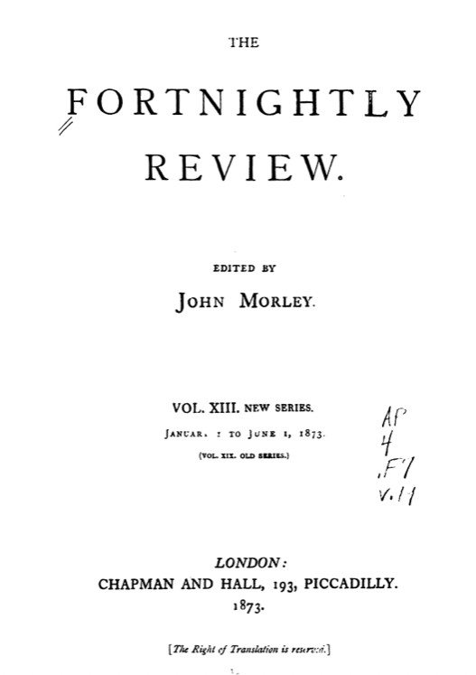
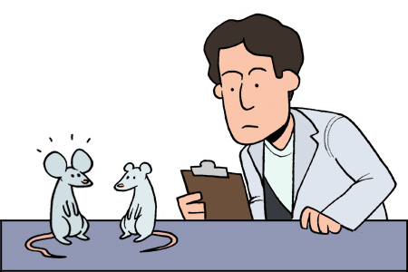

The late 1860s and early 1870s are the era of the [Victorian periodical](https://en.wikipedia.org/wiki/List_of_19th-century_British_periodicals). While outlets existed for the natural sciences such as [Nature](https://en.wikipedia.org/wiki/Nature_(journal)) and [Transactions of the Royal Society](https://en.wikipedia.org/wiki/Philosophical_Transactions_of_the_Royal_Society), we are a few years away from widespread English-language specialized journals in philosophy, economics, and so forth. [Mind](https://en.wikipedia.org/wiki/Mind_(journal)) debuts in 1876, the [Quarterly Journal of Economics](https://en.wikipedia.org/wiki/The_Quarterly_Journal_of_Economics) (QJE) and [Political Science Quarterly](https://en.wikipedia.org/wiki/Political_Science_Quarterly) (PSQ) in 1886, and the [Journal of the American Statistical Association](https://en.wikipedia.org/wiki/Journal_of_the_American_Statistical_Association) in 1888.  

Our topics of interest were mostly discussed in monthly/quarterly periodicals that bound together fiction, translations, policy debate, new ideas, critique, and the occasional petty dispute. Articles during this time occupy a middle ground between journal articles written for an academic audience and essays one would find in today's periodicals such as [Harper's](https://harpers.org) or [the Atlantic](https://en.wikipedia.org/wiki/The_Atlantic), though both existed at the time. These publications put the burden of context on the reader, since articles frequently feature technical discussions, respond to one another, lack sufficient references, and contain limited background material.

Several hot topics pervade the selections below. Though [Darwinism](https://plato.stanford.edu/entries/darwinism/) was just over a decade old, evolutionary thinking grew in influence throughout the 19th century. While Darwinian evolution is often alluded to as a sort of paradigm shift, [On Diversity of Evolution under one set of External Conditions](#on-diversity-of-evolution-under-one-set-of-external-conditions) refines the natural selection model and [The Study of Sociology](#the-study-of-sociology) attempts to ground social science in evolutionary theory. 

The recent Franco-Prussian War and the rise of the [German Empire](https://www.britannica.com/place/German-Empire) set the background for much foreign and domestic policy discussion in Western Europe. [Causes of War in the Existing European Situation](#causes-of-war-in-the-existing-european-situation) extensively surveys the international relations landscape. This coincided with a rise in interest in German philosophy such as Hegelianism and other post-Kantian metaphysics. 

Of the bunch, I most enjoyed Walter Bagehot's book [Lombard Street](#lombard-street-a-description-of-the-money-market) and Thomas Edward Cliffe Leslie's article [Economic Science and Statistics](#economic-science-and-statistics).

**Economics**  
[Lombard Street: A Description of the Money Market](#lombard-street-a-description-of-the-money-market) by Walter Bagehot  
[The Meaning and Causes of Value](#the-meaning-and-causes-of-value) by Albert S. Bolles  
[Economic Science and Statistics](#economic-science-and-statistics) by Thomas Edward Cliffe Leslie  

**Philosophy**  
[The Study of Sociology](#the-study-of-sociology) by Herbert Spencer  
[Old and New Systems of Logic](#old-and-new-systems-of-logic) by Frank Preston Stearns  
[On Truth and Lie in an Extra-moral Sense](#on-truth-and-lie-in-an-extra-moral-sense) by Friedrich Nietzsche  
[A New Phase of German Thought](#a-new-phase-of-german-thought) by Léon Dumont  
[On the Influence of John Stuart Mill's Writings](#on-the-influence-of-john-stuart-mills-writings) by Edith Simcox  

**Math**  
[Who Discovered the Quantification of the Predicate?](#who-discovered-the-quantification-of-the-predicate) by William Stanley Jevons  
[On the Hypotheses Which Lie at the Bases of Geometry](#on-the-hypotheses-which-lie-at-the-bases-of-geometry) by Bernhard Riemann  
[Logic of Relatives](#description-of-a-notation-for-the-logic-of-relatives-resulting-from-an-amplification-of-the-conceptions-of-booles-calculus-of-logic) by C.S. Peirce  

**International Relations**  
[Bismarckism in England](#bismarckism-in-england) by Edward Jenkins  
[Causes of War in the Existing European Situation](#causes-of-war-in-the-existing-european-situation) by Émile Louis Victor de Laveleye  
[The Promotion of Scientific Research](#the-promotion-of-scientific-research) by George Gore  

**Other Topics**  
[Studies in the History of the Renaissance](#studies-in-the-history-of-the-renaissance) by Walter Pater  
[On Diversity of Evolution under one set of External Conditions](#on-diversity-of-evolution-under-one-set-of-external-conditions) by J. T. Gulick  
[Liberal Education in the Nineteenth Century](#liberal-education-in-the-nineteenth-century) by William P. Atkinson  

# Economics

## Lombard Street: A Description of the Money Market
______

Author: [Walter Bagehot](https://en.wikipedia.org/wiki/Walter_Bagehot)

Link: [Internet Archive](https://archive.org/details/lombardstreetad00bagegoog/page/n12/mode/2up)

[Lombard Street](https://en.wikipedia.org/wiki/Lombard_Street,_London) is a street in London, not dissimilar to [Wall Street](https://en.wikipedia.org/wiki/Wall_Street), that for centuries was the epicenter of world finance. In this book, Walter Bagehot eschews the theoretical models of the political economists to offer an approachable perspective on London's banking and finance system. Bagehot's analysis is informed by serving the prior decade as editor-in-chief of [_The Economist_](https://en.wikipedia.org/wiki/The_Economist#History). This book is regarded as one of the first to explain the structure of the banking system and responses to liquidity crises to a wide audience. 

The discussion is anchored around the Banking Department of the [Bank of England](https://en.wikipedia.org/wiki/Bank_of_England) and its peculiar role as a banker's bank. The peculiarity comes from it being a central bank (of sorts) as the government's banker yet a private bank with shareholders and dividends. To modern eyes, it's odd that it's neither [owned by](https://bankunderground.co.uk/2019/10/18/the-ownership-of-central-banks/) nor has effective oversight by the government. Bagehot argues that having a single reserve bank rather than a distributed system of private banks is an historical accident; while he strongly prefers the latter, he believes we're stuck with the former and should seek to make the best of it.

A recurrent topic is the management of [liquidity crises](https://en.wikipedia.org/wiki/Liquidity_crisis), precipitated by the failure of the bank [Overend, Gurney & Company](https://en.wikipedia.org/wiki/Overend,_Gurney_and_Company) and the ensuing [panic in 1866](https://en.wikipedia.org/wiki/Panic_of_1866). Such a crisis occurs when an actor in the banking system needs funds to pay an obligation but there are no funds available to borrow, leading to possible cascading defaults. Bagehot argues the one reserve bank structure causes financial crises by incentivizing banks in the middle to carry more risk. When liquidity crises do occur, Bagehot advises firms to continue borrowing/lending normally as much as possible to attempt to ride out the panic.

## The Meaning and Causes of Value
______

Author: [Albert S. Bolles](http://onlinebooks.library.upenn.edu/webbin/book/lookupname?key=Bolles%2C%20Albert%20Sidney%2C%201846-1939)

Publication: [North American Review](https://en.wikipedia.org/wiki/North_American_Review)

Link: [JSTOR](https://www.jstor.org/stable/25109773)

This paper offers an informal and intuitive statement of a [subjective theory of value](https://en.wikipedia.org/wiki/Subjective_theory_of_value) in economics. In particular, the author seeks to distinguish the notion of value as based on subjective utility from the [labor theory of value](https://en.wikipedia.org/wiki/Labor_theory_of_value). On this account, a good has some utility for a person, but value only comes from the extent to which others find utility in the good. Thus, [Robinson Crusoe](https://en.wikipedia.org/wiki/Robinson_Crusoe#Influence_on_literature) may find much utility from his goods on the island; yet, they have no value. This account is able to explain the [diamond/water paradox](https://en.wikipedia.org/wiki/Paradox_of_value). 

I particularly like the analogy used to [explain willingness to pay/sell](https://en.wikipedia.org/wiki/Willingness_to_pay) and [revealed preference](https://en.wikipedia.org/wiki/Revealed_preference):
>"There are many rocks which are unseen when the waters are high, that appear to view when the waters recede. Yet the rocks are there, whether the waters are high or low. So with our desires."

## Economic Science and Statistics
______

Author: [Thomas Edward Cliffe Leslie](https://en.wikipedia.org/wiki/Thomas_Edward_Cliffe_Leslie)

Publication: [The Athenaeum](https://en.wikipedia.org/wiki/The_Athenaeum_(British_magazine))

Link: [Google Books](https://books.google.com/books?id=QlICAAAAMAAJ&pg=PA375#v=onepage&q&f=false)

In the nineteenth century, some considered statistics to be merely the tabulation of data. Leslie argues for a more robust conception in economics that aims not only to evaluate theory but to discover relationships and economic laws. 

>"If statisticians have often been content to collect phenomena without heed to their laws, economists more often still have jumped to the laws without heed to the phenomena."

Combining statistics and economics has had beneficial effects on both fields. The former has gained a clear set of claims to empirically evaluate i.e. classical economics, and the latter has their deductions checked by reality. For instance, classical economists assumed something along the lines of [the law of one price](https://en.wikipedia.org/wiki/Law_of_one_price) for wages, which says that competition equalizes wages for comparable labor across geographic areas. However, wage data does not agree with this claim. 

Leslie discusses the limitations of empirical reasoning in so far as some data is either difficult to obtain or highly suspect. For instance, private firms have a clear incentive to either withhold or embellish their profits (or rather diminish their losses).

# Philosophy

## The Study of Sociology
______

Author: [Herbert Spencer](https://iep.utm.edu/spencer/)

Link: [Internet Archive](https://archive.org/details/studyofsociology12spenuoft/page/n6/mode/1up)

The Study of Sociology seeks to provide a methodological basis for an evolutionary account of social science, broadly construed. This book is divided into three parts. The first argues that the study of society can be scientific but faces challenges distinct from the natural sciences, since social scientists are embedded in the object of their studies. The second - which spans approximately half of the book - enumerates several challenges for reasoning with historical and sociological data. The final part posits that biology and psychology form the essential background for careful study of society. 

<figure style="display: block; margin: 0px 0px 25px 0px">
  
</figure>

As a defense of social science, this book has mixed results. On the one hand, Spencer convincingly makes the case that social science is difficult due to [confounding](https://en.wikipedia.org/wiki/Confounding), [endogeneity](https://en.wikipedia.org/wiki/Exogenous_and_endogenous_variables), dirty/bad data, researcher biases, and so forth. On the other hand, he comes off as pessimistic as to how much positive inference is even possible by consistently advocating for [Laissez-faire](https://en.wikipedia.org/wiki/Laissez-faire) policies on the basis of complexity. Behind this defense is Spencer's evolutionary model, which awkwardly muddles elements of [natural selection](https://www.nhm.ac.uk/discover/what-is-natural-selection.html) and [Lamarckian inheritance](https://en.wikipedia.org/wiki/Lamarckism) with something like [longtermist](https://en.wikipedia.org/wiki/Longtermism)-flavored utilitarianism. 

An interesting note is that this book led to the creation of [Popular Science magazine](https://www.popsci.com) through a publishing dispute. The Study of Sociology was written at the insistence of Spencer's editor [Edward L. Youmans](https://en.wikipedia.org/wiki/Edward_L._Youmans). Spencer sought for it to be released piecemeal in the [Contemporary Review](https://en.wikipedia.org/wiki/The_Contemporary_Review) in Britain but could not find a suitable American outlet due to differences in standards for dating publications. At the last moment in 1872, Youmans founded The Popular Science Monthly on a shoestring budget and used Spencer's chapters as its centerpiece. 

## Old and New Systems of Logic
______

Author: [Frank Preston Stearns](https://en.wikipedia.org/wiki/Frank_Preston_Stearns) 

Publication: [Journal of Speculative Philosophy](https://www.jstor.org/journal/jspecphil)

Link: [JSTOR](https://www.jstor.org/stable/25665846)

This article discusses the [Hegelian notion of logic](https://plato.stanford.edu/entries/hegel-dialectics/) in [Charles Carroll Everett's](https://en.wikipedia.org/wiki/Charles_Carroll_Everett) [_The Science of Thought: A System of Logic_](https://babel.hathitrust.org/cgi/pt?id=hvd.hn3mrm&seq=7) (1869). While the old logic is the rigid and narrow stuff that produced the (in the author's view) mess of [scholastic metaphysics](https://en.wikipedia.org/wiki/Scholasticism), the new logic is expansive, covering nearly all rigorous thought. 

Everett identifies logic with the "science of thought", which covers deduction, induction, and identification as methods of reasoning. Deduction is essentially the [Aristotelian logic](https://plato.stanford.edu/entries/aristotle-logic/) which makes heavy use of the syllogism. Induction is the methods of empirical science which follow from the work of [Francis Bacon](https://plato.stanford.edu/entries/francis-bacon/#SciMetNovOrgTheInd). Identification covers methods of classification such as classifying the species of a fish by comparing the features of a particular fish to the features of the various species. 

Clearly, the Hegelians had much enthusiasm for their logic:

>"The new system is indeed, compared with the old, what a living, active, thinking human being is to an Egyptian mummy. The last is an historical relic, valuable and interesting to the student; but the first is the real fact of to-day, on a mission of vital importance, and with all the great possibilities of the future before him."

I find this discussion to not be much more than semantics. Expanding the scope of logic to be all rigorous thought doesn't actually change the thought. The motivation seems to be to bring the formal notion of logic into alignment with the lay conception, which is something we've accomplished today with the field of [informal logic](https://plato.stanford.edu/entries/logic-informal/).

## On Truth and Lie in an Extra-moral Sense
______

Author: [Friedrich Nietzsche](https://plato.stanford.edu/entries/nietzsche/)

Original Title: Über Wahrheit und Lüge im aussermoralischen Sinne

Translated in [_The Portable Nietzsche_](https://archive.org/details/ThePortableNietzscheWalterKaufmann/page/n9/mode/2up) (1954) edited by [Walter Kaufmann](https://en.wikipedia.org/wiki/Walter_Kaufmann_(philosopher))

This is a short but beautifully written essay; however, I'm not sure how much it actually says. Nietzsche posits that truth is a concept born from the necessity of society. While we may think of truth in a sort of [correspondence to reality](https://en.wikipedia.org/wiki/Correspondence_theory_of_truth) (at least informally), this is a cognitive bias. Rather, what we take as truths are mere conventions. Or as Nietzsche puts it, truths are "a sum of human relations which have been enhanced, transposed, and embellished poetically and rhetorically, and which after long use seem firm, canonical, and obligatory to a people".

## A New Phase of German Thought
______

Author: [Léon Dumont](https://en.wikipedia.org/wiki/Léon_Dumont)

Translated by [Augustus Rodney Macdonough](https://en.wikipedia.org/wiki/Augustus_Rodney_Macdonough)

Publication: [Popular Science Monthly](https://en.wikipedia.org/wiki/Popular_Science)

Link: [WikiSource Part I](https://en.wikisource.org/wiki/Popular_Science_Monthly/Volume_2/December_1872/A_New_Phase_of_German_Thought_I) - [WikiSource Part II](https://en.wikisource.org/wiki/Popular_Science_Monthly/Volume_2/January_1873/A_New_Phase_of_German_Thought_II)

This is a critical review of [Eduard von Hartmann's](https://en.wikipedia.org/wiki/Eduard_von_Hartmann) [Philosophy of the Unconscious](https://en.wikipedia.org/wiki/Philosophy_of_the_Unconscious) (1869). This book sought to unite the thought of [Hegel](https://plato.stanford.edu/entries/hegel/) and [Schopenhauer](https://iep.utm.edu/schopenh/) and was widely read in Germany. Hartmann argues that physical theories cannot explain all phenomena in the world and, thus, metaphysical principles are required. In particular, Hartmann claims that there is an unconscious intellect guiding phenomena. 

>"Darwin and Hartmann stand at the opposite poles of modern thought. To Darwin belongs the most fertile idea of the age, an idea which upsets all the ancient ways of conceiving the world, and includes the first natural explanation yet given of order, of organization, and of intelligence itself. Hartmann, on the contrary, takes us back to the ancient labyrinths of teleology"

But why should this intellect be unconscious at all? The author attributes this to a pessimism found in [post-Kantian German philosophy](https://iep.utm.edu/germidea/) that the world or existence or humanity is essentially evil. In this way, Hartmann, as a spiritualist and pessimist, is not forced to attribute wickedness to his creator.

## On the Influence of John Stuart Mill's Writings
______

Author: [Edith Simcox](https://en.wikipedia.org/wiki/Edith_Simcox)

Publication: [The Contemporary Review](https://en.wikipedia.org/wiki/The_Contemporary_Review#History)

Link: [HathiTrust](https://babel.hathitrust.org/cgi/pt?id=chi.12662521&view=1up&seq=11)

This article reflects on the work of [John Stuart Mill](https://plato.stanford.edu/entries/mill/) following his death in 1873. Simcox argues that Mill's influence is greater than is generally thought across economics and philosophy, since he focused more on clarifying and systematizing than advancing a particular _Millian_ programme. Moreover, Mill's temperament and penchant for tolerance led him to consider or represent all sides of an issue - even when rhetorically unwarranted. The positions Mill did support can best be seen as expressions of freedom. 

# Math

## Who Discovered the Quantification of the Predicate?
______

Author: [William Stanley Jevons](https://plato.stanford.edu/entries/william-jevons/)

Publication: [The Contemporary Review](https://en.wikipedia.org/wiki/The_Contemporary_Review#History)

Link: [Google Books](https://books.google.com/books?id=Q4MFAAAAQAAJ&pg=PA821#v=onepage&q&f=false)

In [The Study of Sociology](#the-study-of-sociology) (1873), [Herbert Spencer](https://plato.stanford.edu/entries/spencer/) attributed the quantification of the predicate to [George Bentham](https://en.wikipedia.org/wiki/George_Bentham) and later [De Morgan](https://en.wikipedia.org/wiki/Augustus_De_Morgan) while recounting recent British contributions to scientific thought. As this discovery was commonly attributed to the Scottish philosopher [William Hamilton](https://en.wikipedia.org/wiki/Sir_William_Hamilton,_9th_Baronet), a contemporary of Bentham, a priority dispute emerged which played out in the Contemporary Review (where the chapters of Spencers' book were published in Britain). Note that this William Hamilton is unfortunately not the [William Hamilton](https://en.wikipedia.org/wiki/William_Rowan_Hamilton) of [quaternion](https://en.wikipedia.org/wiki/Quaternion) and [Hamiltonian circuit](https://en.wikipedia.org/wiki/Hamiltonian_path) fame.

In first-order logic, a single-variable [predicate](https://en.wikipedia.org/wiki/Predicate_(mathematical_logic)) refers to a property of objects. For example, $Px$ might mean "$x$ is purple". Predicate quantification refers to reasoning about logical formulas involving predicates that include "for all $x$" and "for some $x$" quantifiers. Sentences using quantified predicates had been studied [as far back as Aristotle](https://en.wikipedia.org/wiki/Quantifier_(logic)#History) but had not been mathematically studied until the early nineteenth century.

This short article weighs in on the priority dispute in support of Bentham. Jevons is responding to [Spencer Baynes](https://en.wikipedia.org/wiki/Thomas_Spencer_Baynes), one of Hamilton's former students, who is leading the charge in favor of Hamilton and had cited Jevons as taking his side. In adjudicating the case, the clear piece of evidence is that in 1833 Hamilton reviewed Bentham's 1827 book but fails to later mention Bentham's work later despite advancing a similar account of quantification. As far as I can tell, this dispute is [still unresolved](https://link.springer.com/article/10.1007/s10849-011-9144-y).

## On the Hypotheses Which Lie at the Bases of Geometry
______

Author: [Bernhard Riemann](https://en.wikipedia.org/wiki/Bernhard_Riemann)

Original Title: Über die Hypothesen, welche der Geometrie zugrunde liegen

Translated by [William Kingdon Clifford](https://en.wikipedia.org/wiki/William_Kingdon_Clifford)

Publication: [Nature](https://en.wikipedia.org/wiki/Nature_(journal))

Link: [Click here](https://www.nature.com/articles/008014a0)

The middle of the nineteenth century saw the emergence of [non-Euclidean geometries](https://en.wikipedia.org/wiki/Non-Euclidean_geometry). Thinking in two dimensions, these are spaces that are not necessarily flat such that lines in these spaces may look like curves to an outside observer. This difficult little paper introduces an approach to defining spaces where notions of length, area, angles, and so forth make sense at any given point in the space but those notions may vary smoothly from point to point. This construction generalizes [Euclidean space](https://en.wikipedia.org/wiki/Euclidean_space) which is flat and whose magnitude looks the same at every point. Riemann concludes by considering how to describe physical space in light of this construction.

This paper is based on a lecture given by Riemann in 1854 but only published posthumously in German in 1867 and in English in 1873. Building on prior work of [Gauss](https://en.wikipedia.org/wiki/Carl_Friedrich_Gauss), Riemann's advisor, this paper and its subsequent program was foundational to both modern [differential geometry](https://en.wikipedia.org/wiki/Differential_geometry) and the mathematics of [general relativity](https://en.wikipedia.org/wiki/General_relativity).

## Description of a Notation for the Logic of Relatives, Resulting from an Amplification of the Conceptions of Boole's Calculus of Logic
______

Author: [Charles Sanders Peirce](https://en.wikipedia.org/wiki/Charles_Sanders_Peirce)

Publication: [Memoirs of the American Academy of Arts and Sciences](https://www.jstor.org/journal/mameracadartssci)

Link: [JSTOR](https://www.jstor.org/stable/25058006)

The work of [George Boole](https://plato.stanford.edu/entries/boole/) and [Augustus De Morgan](https://en.wikipedia.org/wiki/Augustus_De_Morgan) in the 1840s and 1850s pushed the boundaries of logic beyond its [Aristotelian roots](https://plato.stanford.edu/entries/aristotle-logic/). Boole introduced an [algebraic approach](https://plato.stanford.edu/entries/algebra-logic-tradition/#a184BegModVerAlgLog) which allowed one to determine the validity of syllogistic arguments by arithmetic operations. De Morgan sought to generalize syllogistic patterns of valid arguments to include relations such as the predicate $Lxy$ meaning $x$ loves $y$. Incorporating relations into first-order logic greatly increases its expressivity (but, as discovered by [Alonzo Church in the 1930s](https://en.wikipedia.org/wiki/Entscheidungsproblem#Negative_answer), also introduces undecidability).

In this paper, Peirce extends Boole's logic of algebra approach to represent relations. While the notation is cumbersome at points, this effort is often seen as the [first modern approach to quantification](https://plato.stanford.edu/entries/peirce-logic/#RelaQuanForm) with variable bindings. This is an unusually long paper (62 pages) consisting mostly of derivations with some philosophical commentary throughout, which to me reads more like lecture notes than anything else. Note that this paper was written in 1870 and often attributed to that year but was not published until 1873.

# International Relations

## Bismarckism in England
______

Author: [Edward Jenkins](https://en.wikipedia.org/wiki/Edward_Jenkins_(MP))

Publication: [The Contemporary Review](https://en.wikipedia.org/wiki/The_Contemporary_Review#History)

Link: [HathiTrust](https://babel.hathitrust.org/cgi/pt?id=chi.12662521&view=1up&seq=119)

The [unification of Germany](https://en.wikipedia.org/wiki/Unification_of_Germany) in the latter half of the nineteenth century brought about a [conflict](https://en.wikipedia.org/wiki/Kulturkampf) between [Bismarck's](https://en.wikipedia.org/wiki/Otto_von_Bismarck) nationalist government and the Catholic church over who had power to make various decisions in social institutions. This article critiques [James Fitzjames Stephen's](https://en.wikipedia.org/wiki/James_Fitzjames_Stephen) [Liberty, Equality, Fraternity](https://archive.org/details/libertyequality00stepgoog/mode/2up?view=theater) (1873) which applies Bismarckian arguments to England. Stephen argues that the state ought to take priority whenever state and religion are in conflict, even for decidedly ecclesiastical issues. This view has been called the "New Liberalism" - of which there's been several new New Liberalisms since. Jenkins fears these arguments will be popular with various groups from secularists to Anglicans to get one over on the Catholic church. In doing so, however, fundamental liberal tenets such as secular government and freedom of religious thought will be swept away. 

## Causes of War in the Existing European Situation
______

Author: [Émile Louis Victor de Laveleye](https://en.wikipedia.org/wiki/Émile_Louis_Victor_de_Laveleye)

Publication: [The Fortnightly Review](https://en.wikipedia.org/wiki/The_Fortnightly_Review)

Link: [HathiTrust](https://babel.hathitrust.org/cgi/pt?id=inu.30000070083914&view=1up&seq=159)

This is the applied companion piece to the author's theoretical essay [On the Causes of War, and the Means of Reducing their Number](https://www.google.com/books/edition/On_the_Causes_of_War_and_the_Means_of_Re/6bO2LSaDhZsC?hl=en&gbpv=1&printsec=frontcover) from the prior year. For each of the major players in Western Europe, the author considers the prospects for war and peace and paints a vivid picture of the international relations landscape following the [Franco-Prussian war](https://en.wikipedia.org/wiki/Franco-Prussian_War) in 1870.

<figure style="display: block; margin: 0px 0px 25px 0px">
  
  <figcaption style="text-align: center; caption-side: bottom;">L'Europe en ce Moment (1872) by Louis Ernest Sahib Lesage</figcaption>
</figure>

De Laveleye's long-form analysis is multifaceted. It is occasionally [realist](https://plato.stanford.edu/entries/realism-intl-relations/) such as with considering the ambitions of and likely response to an expanding Germany and when arguing that Holland and Belgium should form a federation to defend against possible incursions of their neighbors. There is even a [Malthusian determinism](https://en.wikipedia.org/wiki/Malthusianism) about populations quickly growing to the carrying capacity of their respective states. 

## The Promotion of Scientific Research
______

Author: [George Gore](https://en.wikipedia.org/wiki/George_Gore_(electrochemist))

Publication: [The Fortnightly Review](https://en.wikipedia.org/wiki/The_Fortnightly_Review)

Link: [HathiTrust](https://babel.hathitrust.org/cgi/pt?id=umn.31951002150405y&view=1up&seq=515)

By the 1870s, England had seen [one industrial revolution](https://en.wikipedia.org/wiki/Industrial_Revolution) come and go and was in the midst of a [second](https://en.wikipedia.org/wiki/Second_Industrial_Revolution). Following [Matthew Arnold's](https://en.wikipedia.org/wiki/Matthew_Arnold) criticism, Gore makes the case that England focuses on inventions and applications to the neglect of theory (although this point is strongly disputed by [Herbert Spencer](https://plato.stanford.edu/entries/spencer/) in [The Study of Sociology](#the-study-of-sociology)). This article argues for greater public investment in [basic research](https://en.wikipedia.org/wiki/Basic_research) to fuel the invention machine, leading to increased material prosperity and stronger national security. 

For the bulk of the article, Gore considers various proposals such as creating state funded research laboratories, paying professors to conduct research, and so forth. There is much veneration of the [German/Prussian model](https://en.wikipedia.org/wiki/Humboldtian_model_of_higher_education) which saw professors and students engaging in research and produced a flurry of material, although of varying quality such as that discussed in [A New Phase of German Thought](#a-new-phase-of-german-thought). Much like [Liberal Education in the Nineteenth Century](#liberal-education-in-the-nineteenth-century) from below, many of the proposals considered here have been widely adopted in the UK and elsewhere. 

# Other Topics

## Studies in the History of the Renaissance
______

Author: [Walter Pater](https://en.wikipedia.org/wiki/Walter_Pater)

Link: [Internet Archive](https://archive.org/details/studiesinhistor01pategoog/page/n5/mode/2up)

This book is a collection of the author's essays on [aesthetics](https://iep.utm.edu/aesthetics/), broadly construed, from the 1860s and early 1870s, the vast majority of which were published in the [Fortnightly Review](https://en.wikipedia.org/wiki/The_Fortnightly_Review). As a whole, these essays approach the work of Renaissance artists and thinkers through a conversation with [Hellenism](https://en.wikipedia.org/wiki/Hellenistic_art) or at least what was then viewed as Hellenistic themes. 

<figure style="float: right; display: inline-block; margin: 10px 0px 10px 25px">
  
  <figcaption style="text-align: center">A sketch of Walter Pater</figcaption>
</figure>

I found the quality of the articles to decrease on average as the book progressed, with the three best covering [Aucassin and Nicolette](https://en.wikipedia.org/wiki/Aucassin_and_Nicolette), [Pico della Mirandola](https://plato.stanford.edu/entries/pico-della-mirandola/), and [Joachim du Bellay](https://en.wikipedia.org/wiki/Joachim_du_Bellay). Perhaps, this was partly due to fatigue from Pater's elegant yet exhausting style of writing.

Upon publication, this book caused a stir at Oxford - where Pater was a tutor - over its short conclusion which could be read as advocating a living-in-the-moment, pleasure seeking lifestyle. Among those influenced by Pater was [Oscar Wilde](https://en.wikipedia.org/wiki/Oscar_Wilde) whose novel [The Picture of Dorian Gray](https://en.wikipedia.org/wiki/The_Picture_of_Dorian_Gray) (1891) is the only book to my knowledge to use the word "languid" more than Pater!

The [Oxford World's Classics](https://oxfordworldsclassics.com) edition provided invaluable notes to understand Pater's varied references. Beyond providing context, these notes illustrate how inaccurate art history was at the time - or at least Pater's command of art history - as paintings, sculptures, and more are misattributed again and again. The introduction included in this edition overreaches a bit with its author seeing more structure in Pater's collection than what seems to me to exist.

## On Diversity of Evolution under one set of External Conditions
______

Author: [J. T. Gulick](https://en.wikipedia.org/wiki/J._T._Gulick)

Publication: [Journal of the Linnean Society of London, Zoology](https://en.wikipedia.org/wiki/Zoological_Journal_of_the_Linnean_Society)

Link: [Internet Archive](https://ia800708.us.archive.org/view_archive.php?archive=/22/items/crossref-pre-1909-scholarly-works/10.1111%252Fj.1096-3642.1868.tb02234.x.zip&file=10.1111%252Fj.1096-3642.1873.tb01670.x.pdf)

This paper asks whether [internal variation mechanisms](https://en.wikipedia.org/wiki/Genetic_drift) drive evolution outside of adaption to external conditions. Gulick uses a sort of natural experiment by observing [tree snails](https://en.wikipedia.org/wiki/Tree_snail) on [O'ahu island in Hawaii](https://en.wikipedia.org/wiki/Oahu). The geography of this island is such that valleys where these snails reside are partitioned by mountain ridges and are otherwise similar except that one side of the island receives more rain than the rest. The author compares difference in species by distance and observes that difference varies positively with distance and is unaffected by the change in weather from one side of the island to the other. Gulick concludes that evolution can occur even when food, climate, and enemies are stable.

## Liberal Education in the Nineteenth Century
______

Author: [William P. Atkinson](https://onlinebooks.library.upenn.edu/webbin/book/lookupname?key=Atkinson%2C%20William%20P%2E%20%28William%20Parsons%29%2C%201820%2D1890)

Publication: [Popular Science Monthly](https://en.wikipedia.org/wiki/Popular_Science)

Link: [WikiSource](https://en.wikisource.org/wiki/Popular_Science_Monthly/Volume_4/November_1873/Liberal_Education_in_the_Nineteenth_Century)

Liberal education in the nineteenth century was centered around Latin and Greek grammar, arithmetic, and geometry. Atkinson characterizes this approach to education as the "grindstone theory", where students disinterestedly pursue difficult tasks devoid of much content to cultivate both discipline and rational ways of thinking. This article argues for a reform of education that is available to all, based on the vernacular, and includes the arts and sciences.

I found this article interesting and engaging but overoptimistic on what a system of education can accomplish. Atkinson's ideas are reminiscent of Paul Lockhart's [A Mathematician's Lament](https://en.wikipedia.org/wiki/A_Mathematician%27s_Lament) (2002) inasmuch as he wants students to engage creatively with the material rather than perform rote exercise. Thankfully, much of the system that the author envisions has come to pass. 

